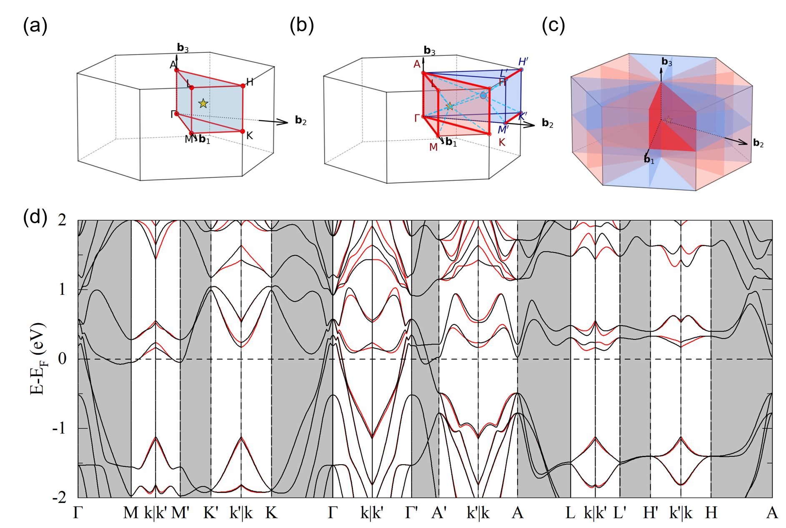

# AlterSeeK-Path

AlterSeeK-Path generates k-point paths for altermagnet band-structure calculations. It inserts a general k point `k` and its spin-flip partner `k'` into a standard high-symmetry path, using the IBZ centroid as the default general point.



**Current support:** VASP workflows. Quantum ESPRESSO support is partial.

For a longer user guide, see
[yujia-teng.github.io/AlterSeeK-Path](https://yujia-teng.github.io/AlterSeeK-Path/).

---

## Installation

Requires Python >= 3.11.

```bash
git clone https://github.com/yujia-teng/AlterSeeK-Path.git
cd AlterSeeK-Path
pip install -r requirements.txt
pip install -e .
```

---

## Quick Start

```bash
alterseek-path
```

The default output file is:

```text
KPOINTS_modified
```

---

## Inputs

### Structure file

- `POSCAR` / `.vasp`/  `.cif`: magnetic moments are entered manually.
- `.mcif`: magnetic moments are read from the file when available.

For `POSCAR`, `.vasp`, and `.cif` input, enter a Cartesian spin axis first.
The default is `0 0 1`. Then type scalar moments along that axis in atom order
using VASP `MAGMOM` format. Syntax such as `5*0 2*1.0` is supported. Untyped
atoms default to `0`.

Step 0 uses FindSpinGroup to identify the magnetic phase, oriented spin-space
group, and spin-flip/spin-preserving operations. The input cell setting is kept
for Step 0, while figures, labels, centroid, and KPOINTS use the standardized
SeeK-path/HPKOT setting. Each run writes the standardized cell and basis mapping
for inspection:

```text
POSCAR_seekpath_standard.vasp
POSCAR_seekpath_basis_mapping.txt
```

### K-path source

- Press Enter in Step 1 to auto-generate the path.
- Or enter a line-mode `KPATH.in` / KPOINTS-style file.

---

## Example Run

```text
=== Altermagnetic K-Path Generator ===

>>> Step 0: Spin symmetry
Enter structure file (default: POSCAR, supports .vasp/.cif/.mcif): GdAuGe.vasp
Spin axis in Cartesian coordinates (default: 0 0 1):
Magnetic moments along this axis (atom order, trailing atoms auto-fill to 0): 1 -1

Lattice type: hP2
Structure: GdAuGe.vasp, atoms: 6
SG P6_3mc (186), PG 6mm, Laue 6/mmm
Phase: AFM(Altermagnet)
Oriented SSG: 186.156.1.1.L
SSG Symbol (Chen-Liu): P -1|6_3 1|m -1|c infinity_{001}m|1
Spin operations: 6 flip, 6 preserve

>>> Step 1: High-symmetry k-path
Path: GAMMA-M-K-GAMMA-A-L-H-A | L-M | H-K
Press [Enter] to use this path, or type a filename to load your own:
Using HPKOT hP2 path (9 segments, 18 k-points)

>>> Step 2: General k-point
IBZ centroid: [0.277778, 0.111111, 0.250000]

>>> Step 3: Spin-flip operation
Found 12 spin-flip operations.
Default R: Option 1
Press [Enter] to use default, type a number, 'list' to show matrices, or 'manual':
Selected: Option 1

>>> Step 4: Build altermagnetic path
[Basis] Converted R from input-cell basis to primitive basis.
[Basis] Annotated spin operation files with standardized-basis matrices.
Primitive-basis R used for KPOINTS:
    [  1.00 -1.00   0 ]
    [  1.00  0.00   0 ]
    [   0   0   1 ]
k' = [-0.1111, 0.3889, 0.2500]
Generated path: GAMMA-M-k | k'-M'-K'-k' | k-K-GAMMA-k | ... | k-H-A | L-M | H-K
Full path: 9 original segments -> 21 generated segments, 36 k-points

>>> Step 5: Save
Enter output filename (default: KPOINTS_modified):
Modified KPOINTS file written to: KPOINTS_modified
Band plot config updated: alterband.toml (lattice_type = "hP2")

Done.
Displaying generated figures...
Saved: .\GdAuGe_ibz_hP2.png
Saved: GdAuGe_spinflip_hP2.png
Saved: GdAuGe_spinbz_hP2.png
Saved: GdAuGe_spinbz_top_hP2.png
```

---

## Band Plotting

After the VASP band calculation:

1. Run VASPKIT task `211`.
2. Run:

```bash
alterseek-path bandplot
```

By default, this reads:

```text
KLABELS
REFORMATTED_BAND_UP.dat
REFORMATTED_BAND_DW.dat
```

and writes one output file:

```text
alterband.png
```

### Plot settings with `alterband.toml`

The main workflow writes `alterband.toml` after KPOINTS generation. The generated
file records the detected lattice type, for example:

```toml
lattice_type = "hP2"
```

If other settings are omitted, the band plotter uses these defaults:

```toml
emin = -2
emax = 2
fig_width = 12
fig_height = 5
gap_width_inches = 0.05
split_panels = 0
output = "alterband.png"
```

Then run:

```bash
alterseek-path bandplot
```

For PDF from the TOML file, set `output = "alterband.pdf"`.

Command-line options override the TOML file. For example:

```bash
alterseek-path bandplot -o alterband.pdf
```

When `lattice_type` is present, special path intervals are shaded light
grey in the band plot. For direct plotting, you can set it manually, for
example `lattice_type = "oF3"`.

Use `split_panels = 2` or `split_panels = 3` for long paths that should be
rendered as stacked panels. Missing or `0` keeps a single panel.

Useful options include `--emin`, `--emax`, `--klabels`, `--up`, `--down`,
`--gap-width-inches`, `--lattice-type`, `--split-panels`, and `-o`.
`alterseek-bandplot` is an optional shortcut for the same command.

---

## Additional Utilities

Standalone spin-flip analysis:

```bash
python find_sf_operations.py
```

IBZ centroid and BZ visualization for one structure:

```bash
python compute_centroid_hybrid.py POSCAR
```

---

## Citation

```bibtex
@article{v3fg-6smc,
  title = {$G$-type antiferromagnetic ${\mathrm{BiFeO}}_{3}$ is a multiferroic $g$-wave altermagnet},
  author = {Urru, Andrea and Seleznev, Daniel and Teng, Yujia and Park, Se Young and Reyes-Lillo, Sebastian E. and Rabe, Karin M.},
  journal = {Phys. Rev. B},
  volume = {112},
  issue = {10},
  pages = {104411},
  numpages = {14},
  year = {2025},
  month = {Sep},
  publisher = {American Physical Society},
  doi = {10.1103/v3fg-6smc},
  url = {https://link.aps.org/doi/10.1103/v3fg-6smc}
}
```
