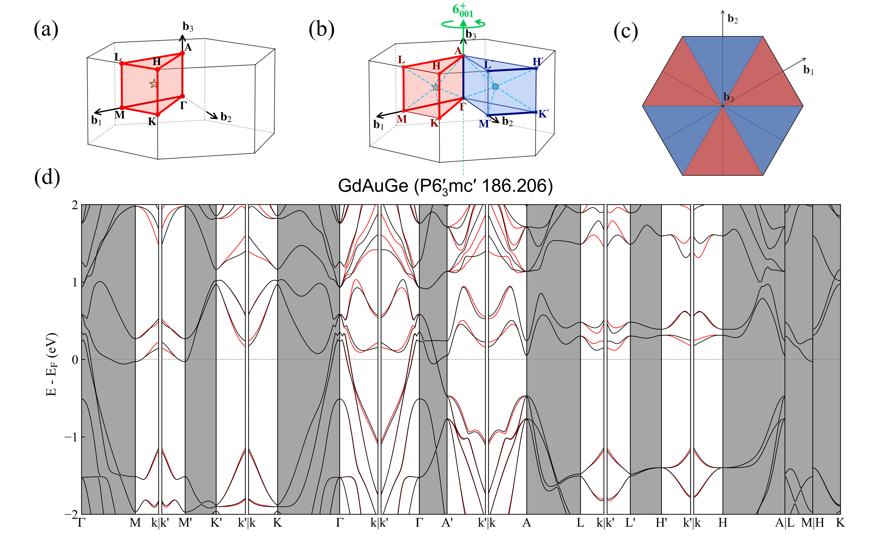

# AlterSeeK-Path

AlterSeeK-Path generates k-point paths for altermagnet band-structure calculations. It inserts a general k point `k` and its spin-flip partner `k'` into a standard high-symmetry path, using the IBZ centroid as the default general point.



---

## Installation

Requires Python >= 3.11.

```bash
git clone https://github.com/yujia-teng/AlterSeeK-Path.git
cd AlterSeeK-Path
pip install -r requirements.txt
pip install -e .
```

---

## Documentation

For a longer user guide, see
[yujia-teng.github.io/AlterSeeK-Path](https://yujia-teng.github.io/AlterSeeK-Path/).

---

## Quick Start

```bash
alterseek-path
```

This runs interactively, prompting for the structure file, spin axis,
moments, k-path, and so on. The default output file is:

```text
KPOINTS_alter
```

To skip the prompts (e.g. for repeated runs on the same structure), put an
`alterseek_input.toml` file in the working directory:

```toml
structure = "POSCAR"
spin_axis = "0 0 1"
moments = "5 -5"
path = ""
flip_option = 1
output_code = "vasp"
```

`alterseek-path` reads any keys it finds and only prompts for the ones that
are missing. See [Workflow](https://yujia-teng.github.io/AlterSeeK-Path/workflow/#skipping-repeated-prompts-with-alterseek_inputtoml)
for the full field reference.

---

## Inputs

- Structure file: `POSCAR` / `.vasp` / `.cif` (moments entered manually) or
  `.mcif` (moments read from the file).
- Spin axis + moments: Cartesian axis (default `0 0 1`) and VASP
  `MAGMOM`-style scalar moments (e.g. `5*0 2*1.0`); missing trailing values
  default to `0`, while excess values are rejected.
- K-path: press Enter for the auto-generated path, or give a line-mode
  `KPATH.in`/KPOINTS-style file. A custom path is interpreted in the reciprocal
  fractional basis of the submitted structure and must contain labeled,
  complete endpoint pairs.

These (plus the Step 3 operation choice and Step 5 output code) can also be
supplied via `alterseek_input.toml` — see Quick Start above.

---

## Example Run

```text
=== Altermagnetic K-Path Generator ===

>>> Step 0: Spin symmetry
Enter structure file (default: POSCAR, supports .vasp/.cif/.mcif): POSCAR
Spin axis in Cartesian coordinates (default: 0 0 1): 0 0 1
Magnetic moments along this axis (atom order, trailing atoms auto-fill to 0): 8 -8 4*0

Input structure: POSCAR, 6 atoms
Nonmagnetic primitive cell:   SG P6_3mc (186)  PG 6mm  Laue 6/mmm  [6 atoms, hP2]
Magnetic primitive cell (G0): SG P6_3mc (186)  PG 6mm  Laue 6/mmm  [6 atoms, hP2]
Phase: AFM(Altermagnet)
Oriented SSG: 186.156.1.1.L
SSG Symbol (Chen-Liu): P -1|6_{3} 1|m -1|c infinity_{001}m|1
MSG without SOC: P6_3'mc' (BNS 186.206), Type III
Spin operations: 6 flip, 6 preserve

>>> Step 1: High-symmetry k-path
Path: GAMMA-M-K-GAMMA-A-L-H-A | L-M | H-K
Press [Enter] to use this path, or type a filename to load your own:
Using HPKOT hP2 path (9 segments, 18 k-points)

>>> Step 2: General k-point
IBZ centroid (standardized basis): [0.277778, 0.111111, 0.250000]
IBZ centroid (KPOINTS output basis): [0.277778, 0.111111, 0.250000]

>>> Step 3: Spin-flip operation
Found 12 spin-flip operations R.
  Note: R is in the submitted structure 'POSCAR' fractional basis;
  rotation axis/mirror plane indices are in the reciprocal (b1,b2,b3) basis.
Default R: Option 1
Press [Enter] to use default, type a number, or 'list' to show matrices: 1
Selected: Option 1  (C6+ [0 0 1])

>>> Step 4: Build altermagnetic path
k' = [-0.1111, 0.3889, 0.2500]
Generated path: GAMMA-M-k | k'-M'-K'-k' | k-K-GAMMA-k | ... | k-H-A | L-M | H-K
Full path: 9 original segments -> 21 generated segments, 36 k-points

>>> Step 5: Save
Output code ([vasp]/qe): vasp
Modified KPOINTS file written to: KPOINTS_alter
Band plot config updated: alterband.toml (lattice_type = "hP2")

Done.
Displaying generated figure(s)...
Saved: alterseek_output\POSCAR_ibz_hP2.png
Saved: alterseek_output\POSCAR_spinflip_hP2.png
Saved: alterseek_output\POSCAR_spinbz_hP2.png
Saved: alterseek_output\POSCAR_spinbz_top_hP2.png
```

---

## 2D / Slab Mode

For 2D materials computed as slabs (vacuum along one lattice vector), run:

```bash
alterseek-path --2d
```

2D mode restricts the k-path and IBZ centroid to the physical in-plane
(vacuum k = 0) reciprocal plane, and reports whether any spin-flip operation
produces in-plane spin splitting. See [Workflow](https://yujia-teng.github.io/AlterSeeK-Path/workflow/#2d-slab-mode)
for the vacuum-axis detection details and output figures.

---

## `--parent-setting`

By default AlterSeeK-Path determines the path from the **magnetic primitive
cell**, the cell that reflects the symmetry of the magnetic state. Final
k-points are written in the reciprocal basis of the calculation cell. An
intentional integer supercell of the magnetic primitive cell is therefore
kept as submitted; a same-volume nontrivial basis change -- e.g. a
hexagonal-looking cell whose magnetism only respects an SSG-adapted
orthorhombic setting -- changes the calculation cell. In that case the working
directory receives the matching `*_magnetic_primitive.vasp` and
`*_magnetic_primitive_MAGMOM.txt`; use their recorded species and moment order
together with the generated `KPOINTS_alter`. This is the physical magnetic
primitive cell in an SSG-adapted setting; path symmetry is determined from
G0, the spatial part of the SSG.

```bash
alterseek-path --parent-setting
```

builds the path in the nonmagnetic parent cell instead. This is useful for
comparing several magnetic orders against one fixed reference path, but that
path does not respect the symmetry of the magnetic state -- and where the
parent is not altermagnetic at all, it cannot represent that state. See
[Workflow](https://yujia-teng.github.io/AlterSeeK-Path/workflow/#-parent-setting)
for details and the `--output verbose` flag.

---

## Band Plotting

After the VASP band calculation and VASPKIT task `211`, run:

```bash
alterseek-path bandplot
```

This reads `KLABELS`/`REFORMATTED_BAND_UP.dat`/`REFORMATTED_BAND_DW.dat` and
writes `alterband.png`, using settings from `alterband.toml` (written
automatically by the main workflow) if present. See
[Plotting](https://yujia-teng.github.io/AlterSeeK-Path/plotting/) for the
full settings reference (energy window, split panels, gap width, etc.).

---

## Citation

```bibtex
@article{v3fg-6smc,
  title = {$G$-type antiferromagnetic ${\mathrm{BiFeO}}_{3}$ is a multiferroic $g$-wave altermagnet},
  author = {Urru, Andrea and Seleznev, Daniel and Teng, Yujia and Park, Se Young and Reyes-Lillo, Sebastian E. and Rabe, Karin M.},
  journal = {Phys. Rev. B},
  volume = {112},
  issue = {10},
  pages = {104411},
  numpages = {14},
  year = {2025},
  month = {Sep},
  publisher = {American Physical Society},
  doi = {10.1103/v3fg-6smc},
  url = {https://link.aps.org/doi/10.1103/v3fg-6smc}
}
```
