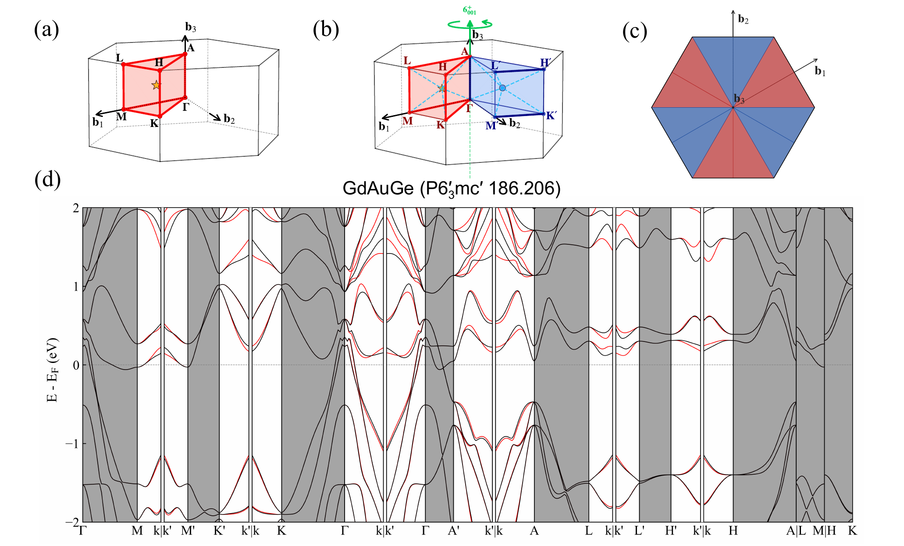

# AlterSeeK-Path

AlterSeeK-Path generates k-point paths for altermagnet band-structure calculations. It inserts a general k point `k` and its spin-flip partner `k'` into a standard high-symmetry path, using the IBZ centroid as the default general point.



**Current support:** VASP workflows. Quantum ESPRESSO support is partial.

For a longer user guide, see
[yujia-teng.github.io/AlterSeeK-Path](https://yujia-teng.github.io/AlterSeeK-Path/).

---

## Installation

Requires Python >= 3.11.

```bash
git clone https://github.com/yujia-teng/AlterSeeK-Path.git
cd AlterSeeK-Path
pip install -r requirements.txt
pip install -e .
```

---

## Quick Start

```bash
alterseek-path
```

The default output file is:

```text
KPOINTS_alter
```

---

## Inputs

- Structure file: `POSCAR` / `.vasp` / `.cif` (moments entered manually) or
  `.mcif` (moments read from the file).
- Spin axis + moments: Cartesian axis (default `0 0 1`) and VASP
  `MAGMOM`-style scalar moments (e.g. `5*0 2*1.0`); untyped atoms default to
  `0`.
- K-path: press Enter for the auto-generated path, or give a line-mode
  `KPATH.in`/KPOINTS-style file.

An optional `alterseek_input.toml` file can supply any of these answers (plus
the Step 3 operation choice and Step 5 output code) so repeated runs don't
require retyping them. See [Workflow](https://yujia-teng.github.io/AlterSeeK-Path/workflow.html#skipping-repeated-prompts-with-alterseek_inputtoml)
for the field reference.

---

## Example Run

```text
=== Altermagnetic K-Path Generator ===

>>> Step 0: Spin symmetry
Enter structure file (default: POSCAR, supports .vasp/.cif/.mcif): POSCAR
Spin axis in Cartesian coordinates (default: 0 0 1): 0 0 1
Magnetic moments along this axis (atom order, trailing atoms auto-fill to 0): 8 -8

Lattice type: hP2
Structure: POSCAR, atoms: 6
SG P6_3mc (186), PG 6mm, Laue 6/mmm
Phase: AFM(Altermagnet)
Oriented SSG: 186.156.1.1.L
SSG Symbol (Chen-Liu): P -1|6_3 1|m -1|c infinity_{001}m|1
MSG without SOC: P6_3'mc' (BNS 186.206), Type III
Spin operations: 6 flip, 6 preserve

>>> Step 1: High-symmetry k-path
Path: GAMMA-M-K-GAMMA-A-L-H-A | L-M | H-K
Press [Enter] to use this path, or type a filename to load your own:
Using HPKOT hP2 path (9 segments, 18 k-points)

>>> Step 2: General k-point
IBZ centroid: [0.277778, 0.111111, 0.250000]

>>> Step 3: Spin-flip operation
Found 12 spin-flip operations.
  Note: matrices are in the input-cell fractional basis; the operation name
  is in fractional basis.
Default R: Option 1
Press [Enter] to use default, type a number, 'list' to show matrices, or 'manual': 1
Selected: Option 1  (C6+ [0 0 1])

>>> Step 4: Build altermagnetic path
[Basis] Converted R from input-cell basis to primitive basis.
[Basis] Annotated spin operation files with standardized-basis matrices.
Primitive-basis R used for KPOINTS:
    [  1.00 -1.00   0 ]
    [  1.00  0.00   0 ]
    [   0   0   1 ]
k' = [-0.1111, 0.3889, 0.2500]
Generated path: GAMMA-M-k | k'-M'-K'-k' | k-K-GAMMA-k | ... | k-H-A | L-M | H-K
Full path: 9 original segments -> 21 generated segments, 36 k-points

>>> Step 5: Save
Output code ([vasp]/qe): vasp
Modified KPOINTS file written to: KPOINTS_alter
Band plot config updated: alterband.toml (lattice_type = "hP2")

Done.
Displaying generated figures...
Saved: .\POSCAR_ibz_hP2.png
Saved: POSCAR_spinflip_hP2.png
Saved: POSCAR_spinbz_hP2.png
Saved: POSCAR_spinbz_top_hP2.png
```

---

## 2D / Slab Mode

For 2D materials computed as slabs (vacuum along one lattice vector), run:

```bash
alterseek-path --2d
```

2D mode restricts the k-path and IBZ centroid to the physical in-plane
(vacuum k = 0) reciprocal plane, and reports whether any spin-flip operation
produces in-plane spin splitting. See [Workflow](https://yujia-teng.github.io/AlterSeeK-Path/workflow.html#2d--slab-mode)
for the vacuum-axis detection details and output figures.

---

## Band Plotting

After the VASP band calculation and VASPKIT task `211`, run:

```bash
alterseek-path bandplot
```

This reads `KLABELS`/`REFORMATTED_BAND_UP.dat`/`REFORMATTED_BAND_DW.dat` and
writes `alterband.png`, using settings from `alterband.toml` (written
automatically by the main workflow) if present. See
[Plotting](https://yujia-teng.github.io/AlterSeeK-Path/plotting.html) for the
full settings reference (energy window, split panels, gap width, etc.).

---

## Citation

```bibtex
@article{v3fg-6smc,
  title = {$G$-type antiferromagnetic ${\mathrm{BiFeO}}_{3}$ is a multiferroic $g$-wave altermagnet},
  author = {Urru, Andrea and Seleznev, Daniel and Teng, Yujia and Park, Se Young and Reyes-Lillo, Sebastian E. and Rabe, Karin M.},
  journal = {Phys. Rev. B},
  volume = {112},
  issue = {10},
  pages = {104411},
  numpages = {14},
  year = {2025},
  month = {Sep},
  publisher = {American Physical Society},
  doi = {10.1103/v3fg-6smc},
  url = {https://link.aps.org/doi/10.1103/v3fg-6smc}
}
```
